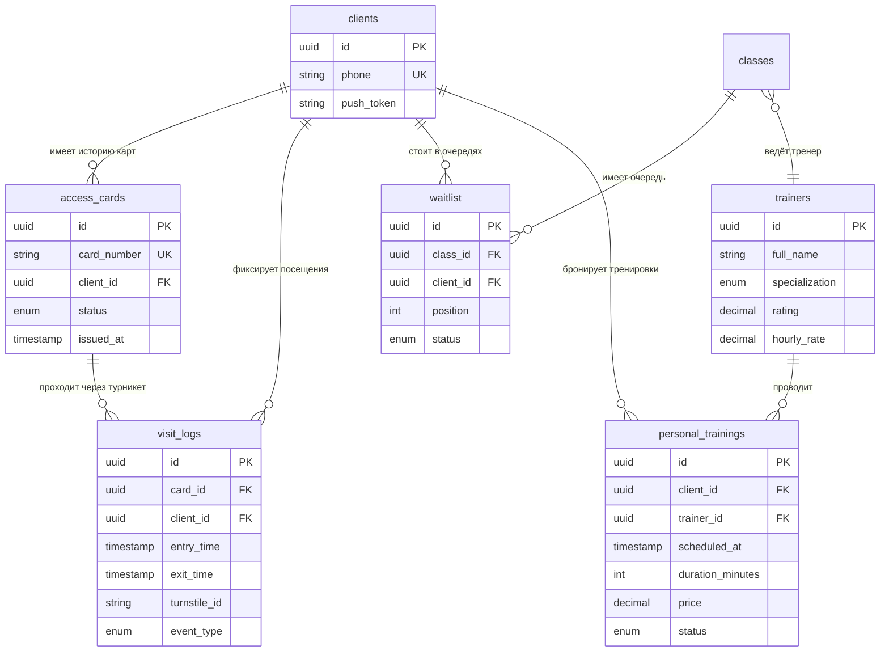

# 📦 ПАКЕТ 1: Итоговая аттестационная работа

## ✅ ЧАСТЬ A. ФИНАЛЬНЫЙ ТЕСТ — 15 ВОПРОСОВ

| №   | Вопрос                                                                                  | Ответ                                                     | Обоснование                                                                                                                                                         |
| --- | --------------------------------------------------------------------------------------- | --------------------------------------------------------- | ------------------------------------------------------------------------------------------------------------------------------------------------------------------- |
| 1   | Что такое пользовательская роль?                                                        | **б) Модель поведения в системе — набор действий и прав** | Роль описывает не должность, а паттерн взаимодействия пользователя с системой (что делает и какие имеет права). Как в Задании 2 по «ПрокатOFF» и «Чистому пиджаку». |
| 2   | Какой сценарий описывает «счастливый путь»?                                             | **в) Основной**                                           | Happy Path — идеальное выполнение сценария без отклонений, альтернатив и ошибок.                                                                                    |
| 3   | Что такое AS IS?                                                                        | **б) Модель «как есть сейчас»**                           | Текущее состояние бизнес-процесса до автоматизации. Фиксирует проблемы и точки роста.                                                                               |
| 4   | Что такое точка автоматизации?                                                          | **б) Шаг процесса, где ручной труд заменяют системой**    | Конкретное место в AS IS, которое передаётся информационной системе для устранения ручной операции.                                                                 |
| 5   | Какой элемент BPMN обозначает действие системы?                                         | **а) Прямоугольник с шестерёнкой**                        | Service Task — задача, выполняемая автоматизированной системой (в отличие от User Task — прямоугольник без шестерёнки).                                             |
| 6   | Что такое Low Coupling?                                                                 | **б) Слабая связанность между компонентами**              | Архитектурный принцип: модули должны минимально зависеть друг от друга. Параллельно с High Cohesion.                                                                |
| 7   | Что такое первичный ключ (PK)?                                                          | **б) Уникальный идентификатор записи**                    | Атрибут (или комбинация), однозначно идентифицирующий каждую строку в таблице. Не может быть NULL.                                                                  |
| 8   | Что такое внешний ключ (FK)?                                                            | **а) Атрибут, ссылающийся на PK другой сущности**         | Обеспечивает ссылочную целостность и реализует связи между таблицами.                                                                                               |
| 9   | Какая связь требует ассоциативную сущность?                                             | **в) M:N**                                                | Связь «многие-ко-многим» нельзя реализовать напрямую в реляционной БД — нужна промежуточная таблица с двумя FK.                                                     |
| 10  | Что такое CRUD-матрица?                                                                 | **б) Таблица: сценарии × сущности × операции**            | Инструмент проверки согласования: по строкам — сценарии, по столбцам — сущности, на пересечении — C/R/U/D.                                                          |
| 11  | Что проверяет `SELECT email, COUNT(*) FROM clients GROUP BY email HAVING COUNT(*) > 1`? | **б) Дубликаты email**                                    | Группировка по email + фильтр HAVING по количеству > 1 находит повторяющиеся адреса.                                                                                |
| 12  | Что такое NULL в SQL?                                                                   | **б) Отсутствие данных**                                  | Специальное маркерное значение, означающее «неизвестно» или «применимо, но не заполнено». Не равно 0 и не равно пустой строке.                                      |
| 13  | Фильтрация строк ДО группировки?                                                        | **б) WHERE**                                              | WHERE фильтрует строки до GROUP BY, HAVING — после группировки (фильтрует уже агрегированные группы).                                                               |
| 14  | Что такое NoSQL?                                                                        | **б) Семейство нереляционных баз**                        | БД, не использующие классическую реляционную модель (документоориентированные, ключ-значение, графовые, колоночные).                                                |
| 15  | Что такое REST API?                                                                     | **б) Интеграция через HTTP-запросы**                      | Архитектурный стиль, использующий стандартные методы HTTP (GET, POST, PUT, DELETE) и ресурсы, идентифицируемые URL.                                                 |

---

## ✅ ЧАСТЬ B. РАЗДЕЛ 2. РЕЕСТР ТРЕБОВАНИЙ

### 2.1. Ответы на открытые вопросы (V-01 – V-05) и новые требования (R-16 – R-20)

| ID       | Открытый вопрос                                 | Ответ аналитика (с обоснованием)                                                                                                                                                                                                                                                                                                                                                                                                                                                                                                                                             | Новое требование                                                                                                                                                                                                                                                                                                         |
| -------- | ----------------------------------------------- | ---------------------------------------------------------------------------------------------------------------------------------------------------------------------------------------------------------------------------------------------------------------------------------------------------------------------------------------------------------------------------------------------------------------------------------------------------------------------------------------------------------------------------------------------------------------------------- | ------------------------------------------------------------------------------------------------------------------------------------------------------------------------------------------------------------------------------------------------------------------------------------------------------------------------ |
| **V-01** | Что при двойном прикладывании карточки?         | Система игнорирует повторные прикладывания одной и той же карты на одном турникете в течение **5 секунд** после успешной авторизации (программный debounce-таймер на контроллере турникета). Сообщение об ошибке **не выводится**. По истечении 5 секунд система готова обработать новое прикладывание как новую валидную операцию (например, выход после входа). Повторные срабатывания в окне 5 сек **не логируются** как ошибки — это штатная защита, а не инцидент.                                                                                                      | **R-16.** Система должна игнорировать повторные считывания одной и той же карты на одном турникете в течение 5 секунд после успешной авторизации. Турникет не перезагружается; по истечении окна защиты система готова к новой валидной операции. Повторные срабатывания в окне защиты не фиксируются в журнале событий. |
| **V-02** | Какая длительность персональной тренировки?     | **60 минут (1 час).** Это прямо следует из интервью директора: _«Персональные тренировки — один на один с тренером... Длительность — час»_. Значение зафиксировано как бизнес-правило и используется при бронировании и расчёте стоимости.                                                                                                                                                                                                                                                                                                                                   | **R-17.** Система должна фиксировать стандартную длительность персональной тренировки как 60 минут при бронировании слота тренера и расчёте стоимости.                                                                                                                                                                   |
| **V-03** | Как клиент попадает в лист ожидания?            | Клиент принимает **осознанное решение**: при попытке записаться на полностью укомплектованное занятие система предлагает кнопку «Встать в лист ожидания». Автоматическая запись без согласия клиента **недопустима** (нарушает права клиента, создаёт риски штрафных санкций за неявку). При освобождении места первый в очереди получает Push/SMS-уведомление «Вы записаны», его статус меняется на «Записан». Если кто-то из записанных отменяет бронь, очередь сдвигается, следующий клиент получает уведомление. Клиент видит свою позицию в очереди в реальном времени. | **R-18.** Система должна позволять клиенту добровольно добавлять себя в лист ожидания на полностью укомплектованное занятие и отображать его текущую позицию в очереди. При освобождении места система автоматически уведомляет первого в очереди; при отмене записи — сдвигает очередь и уведомляет следующего.         |
| **V-04** | Бронирование персональной тренировки за 7 дней? | **Да.** Правило «бронирование за 7 дней вперёд» распространяется на **все типы занятий**, включая персональные тренировки, для унификации бизнес-логики расписания и упрощения поддержки кода.                                                                                                                                                                                                                                                                                                                                                                               | **R-19.** Система должна ограничивать возможность бронирования персональной тренировки сроком не более 7 дней от текущей даты (аналогично групповым занятиям).                                                                                                                                                           |
| **V-05** | Что показывать при заблокированной карточке?    | **Обоснованное допущение аналитика:** турникет оснащён базовым текстовым дисплеем, ресепшн расположен **до** зоны турникетов. Решение — **двухканальное информирование**: (1) на дисплее турникета выводится сообщение _«Карта заблокирована. Обратитесь на ресепшн»_, (2) одновременно система инициирует отправку Push/SMS-уведомления на телефон клиента с тем же текстом (на случай, если клиент уже прошёл зону ресепшена или не видит дисплей). Турникет проход не открывает.                                                                                          | **R-20.** При прикладывании заблокированной карты система должна: (1) блокировать открытие турникета, (2) выводить на дисплей турникета сообщение «Карта заблокирована. Обратитесь на ресепшн», (3) инициировать отправку Push/SMS-уведомления клиенту.                                                                  |

### 2.2. Сводная таблица раздела 2 (шаблон)

| ID   | Тип    | Формулировка                                                                                                                                                                                          | Источник                 | Статус  |
| ---- | ------ | ----------------------------------------------------------------------------------------------------------------------------------------------------------------------------------------------------- | ------------------------ | ------- |
| R-16 | Запрос | Система игнорирует повторные считывания одной карты на одном турникете в течение 5 секунд после успешной авторизации; турникет не перезагружается; повторные срабатывания в окне защиты не логируются | Аналитик (закрытие V-01) | Принято |
| R-17 | Запрос | Система фиксирует стандартную длительность персональной тренировки как 60 минут при бронировании и расчёте стоимости                                                                                  | Директор (интервью)      | Принято |
| R-18 | Запрос | Система позволяет клиенту добровольно добавлять себя в лист ожидания, отображает позицию в очереди; при освобождении места уведомляет первого в очереди; при отмене записи — сдвигает очередь         | Аналитик (закрытие V-03) | Принято |
| R-19 | Запрос | Система ограничивает бронирование персональной тренировки сроком не более 7 дней от текущей даты                                                                                                      | Аналитик (закрытие V-04) | Принято |
| R-20 | Запрос | При заблокированной карте: блокировка турникета + сообщение на дисплее + Push/SMS-уведомление клиенту                                                                                                 | Аналитик (закрытие V-05) | Принято |

---

## ✅ ЧАСТЬ C. РАЗДЕЛ 1. ОБЩЕЕ ОПИСАНИЕ

### 1.1. Назначение документа

Настоящий документ (SRS — Software Requirements Specification) описывает требования к **доработке** существующей информационной системы сети фитнес-клубов «Сила». Система работает 3 месяца; доработка включает: внедрение электронных пропускных карточек с контролем входа **и выхода**, расширение типов занятий (единоборства, персональные тренировки), доработку механизма бронирования (лист ожидания, правило 7 дней) и функционал выбора тренера. Документ предназначен для команды разработки, тестировщиков и стейкхолдеров как единый источник истины по скоупу доработки.

### 1.2. Границы системы

**Что ВХОДИТ в систему (In Scope):**

1. Модуль контроля доступа: считывание карт на турникетах, проверка активности абонемента, открытие/блокировка прохода, фиксация факта **входа и выхода** клиента (журнал посещений).
2. Модуль бронирования: групповые занятия (йога, пилатес, сайкл, бокс, дзюдо) и персональные тренировки с правилом «бронь за 7 дней, отмена за 2 часа».
3. Модуль листа ожидания: добровольная запись клиента в очередь, отображение позиции, автоматическое уведомление при освобождении места.
4. Модуль управления тренерами: профили тренеров (специализация, рейтинг), фильтрация расписания по тренеру.
5. Модуль управления карточками: выпуск при покупке абонемента, блокировка при потере, перевыпуск за 500 рублей.
6. Интеграция с турникетным контроллером (аппаратная часть) и платёжным шлюзом.

**Что НЕ ВХОДИТ в систему (Out of Scope):**

1. Система видеонаблюдения и физическая охрана клуба.
2. Модуль складского учёта инвентаря и оборудования (боксерские груши, перчатки и т.п.).
3. Мобильное приложение клиента (в рамках данной доработки — только веб-интерфейс и интеграция с турникетами).
4. Кадровый учёт и расчёт заработной платы тренеров.
5. CRM-маркетинг и программы лояльности (бонусы, реферальные системы).

### 1.3. Пользователи системы (текущие)

| Роль                                   | Описание                                                       | Ключевые задачи                                                                                                     |
| -------------------------------------- | -------------------------------------------------------------- | ------------------------------------------------------------------------------------------------------------------- |
| **Клиент**                             | Конечный пользователь, владелец абонемента и электронной карты | Вход/выход по карте, бронирование занятий (групповых и персональных), запись в лист ожидания, выбор тренера, оплата |
| **Администратор**                      | Сотрудник ресепшена, работает в системе ежедневно              | Выпуск/блокировка/перевыпуск карт, управление расписанием, обработка листа ожидания, отметки посещаемости           |
| **Тренер**                             | Проводит групповые и персональные тренировки                   | Просмотр своего расписания, подтверждение персональных тренировок, управление профилем (специализация)              |
| **Директор**                           | Заказчик, принимает стратегические решения                     | Просмотр отчётов (выручка, посещаемость, загрузка залов), управление абонементами, контроль работы системы          |
| **Система турникетов** (внешний актор) | Аппаратный контроллер + дисплей + считыватель карт             | Физический контроль прохода, отображение сообщений, отправка событий в центральную систему                          |

### 1.4. Допущения и зависимости

**Допущения:**

- [Допущение 1] Турникеты оснащены текстовыми дисплеями для вывода сообщений клиенту.
- [Допущение 2] Ресепшн расположен **до** зоны турникетов — клиент может обратиться к администратору до прохода в зал.
- [Допущение 3] У каждого клиента есть мобильный телефон для получения Push/SMS-уведомлений.
- [Допущение 4] Существующая БД (таблицы `clients`, `memberships`, `bookings`, `classes`, `payments`) остаётся и расширяется новыми сущностями.
- [Допущение 5] Платёжный шлюз уже интегрирован в текущую систему (доработка не затрагивает базовый функционал оплаты).

**Зависимости:**

- Работоспособность аппаратных турникетов и их контроллеров.
- Доступность платёжного шлюза для перевыпуска карт (500 руб.) и оплаты персональных тренировок.
- Стабильная работа SMS/Push-шлюза для уведомлений из листа ожидания.

---

## ✅ ЧАСТЬ D. РАЗДЕЛ 5. МОДЕЛЬ ДАННЫХ

### 5.1. Новые сущности

**СУЩНОСТЬ 1: `access_cards` (Электронные карты доступа)**

- **Назначение:** Хранит данные электронных пропускных карт клиентов.
- **Атрибуты:**
  - `id` (PK, суррогатный, UUID)
  - `card_number` (уникальный, естественный — номер карты на RFID-чипе)
  - `client_id` (FK → clients.id)
  - `status` (обязательный: `active` / `blocked` / `lost`)
  - `issued_at` (обязательный, timestamp — дата выпуска)
  - `blocked_at` (опциональный, timestamp — дата блокировки)
  - `reissue_count` (целое, по умолчанию 0 — количество перевыпусков)
- **Внешние ключи:** `client_id` → `clients.id` (связь 1:M: у клиента может быть несколько карт в истории, но только одна `active`)

**СУЩНОСТЬ 2: `visit_logs` (Журнал посещений — вход/выход)**

- **Назначение:** Фиксирует факты входа и выхода клиентов через турникеты. Ключевая новая сущность, появившаяся после уточнения кейса (клиент прикладывает карту и на входе, и на выходе).
- **Атрибуты:**
  - `id` (PK, суррогатный, UUID)
  - `card_id` (FK → access_cards.id)
  - `client_id` (FK → clients.id — для быстрого поиска без JOIN)
  - `entry_time` (обязательный, timestamp — время входа)
  - `exit_time` (опциональный, timestamp — время выхода; NULL, пока клиент в зале)
  - `turnstile_id` (обязательный, ID турникета — для аудита)
  - `event_type` (обязательный: `entry` / `exit`)
- **Внешние ключи:** `card_id` → `access_cards.id`, `client_id` → `clients.id`
- **Бизнес-правило:** При входе создаётся запись с `event_type='entry'` и `exit_time=NULL`. При выходе система находит последнюю открытую запись клиента (где `exit_time IS NULL`) и проставляет `exit_time` + создаёт новое событие `exit` (или обновляет существующую запись — на усмотрение архитектора).

**СУЩНОСТЬ 3: `waitlist` (Лист ожидания)**

- **Назначение:** Хранит очередь клиентов на полностью укомплектованные занятия.
- **Атрибуты:**
  - `id` (PK, суррогатный, UUID)
  - `class_id` (FK → classes.id)
  - `client_id` (FK → clients.id)
  - `position` (целое, вычисляемый — позиция в очереди)
  - `status` (обязательный: `waiting` / `booked` / `cancelled` / `expired`)
  - `added_at` (обязательный, timestamp)
  - `notified_at` (опциональный, timestamp — когда клиент получил уведомление о записи)
- **Внешние ключи:** `class_id` → `classes.id`, `client_id` → `clients.id`
- **Бизнес-правило:** Уникальный индекс `(class_id, client_id, status='waiting')` — клиент не может стоять в очереди дважды на одно занятие.

**СУЩНОСТЬ 4: `trainers` (Тренеры)**

- **Назначение:** Профили тренеров для фильтрации расписания и персональных тренировок.
- **Атрибуты:**
  - `id` (PK, суррогатный, UUID)
  - `full_name` (обязательный)
  - `specialization` (обязательный: `boxing` / `judo` / `yoga` / `pilates` / `cycle` / `personal`)
  - `rating` (decimal, 0.00–5.00, по умолчанию NULL — до получения отзывов)
  - `hourly_rate` (decimal, обязательный — стоимость персональной тренировки)
  - `is_active` (boolean, по умолчанию true)
- **Внешние ключи:** — (справочник)

**СУЩНОСТЬ 5: `personal_trainings` (Персональные тренировки)**

- **Назначение:** Брони персональных тренировок (отличаются от групповых занятий).
- **Атрибуты:**
  - `id` (PK, суррогатный, UUID)
  - `client_id` (FK → clients.id)
  - `trainer_id` (FK → trainers.id)
  - `scheduled_at` (обязательный, timestamp — дата и время тренировки)
  - `duration_minutes` (целое, по умолчанию 60 — см. R-17)
  - `price` (decimal, обязательный — рассчитывается от `trainers.hourly_rate`)
  - `status` (обязательный: `scheduled` / `completed` / `cancelled` / `no_show`)
  - `created_at` (обязательный, timestamp)
- **Внешние ключи:** `client_id` → `clients.id`, `trainer_id` → `trainers.id`
- **Бизнес-правило:** Уникальный индекс `(trainer_id, scheduled_at)` — тренер не может проводить две тренировки одновременно.

### 5.2. Изменения в существующих сущностях

**СУЩНОСТЬ: `classes` (Групповые занятия)**

- Новые атрибуты:
  - `class_type` (обязательный, enum: `group` / `martial_arts` / `personal`) — различие между обычными групповыми, единоборствами и персональными
  - `includes_equipment` (boolean, по умолчанию false) — включён ли инвентарь в стоимость (для единоборств — true)
  - `max_capacity` (целое, обязательный — лимит мест для листа ожидания)
  - `trainer_id` (FK → trainers.id, опциональный — для фильтрации по тренеру)

**СУЩНОСТЬ: `memberships` (Абонементы)**

- Новые атрибуты:
  - `freeze_status` (enum: `active` / `frozen`) — поддержка замороженных абонементов (упомянуто в интервью)
  - `frozen_until` (опциональный, date — до какого числа заморожен)

**СУЩНОСТЬ: `clients` (Клиенты)**

- Новые атрибуты:
  - `phone` (обязательный, уникальный — для Push/SMS уведомлений)
  - `push_token` (опциональный — токен для Push-уведомлений)

### 5.3. Новые связи

| Связь                                  | Тип | Пояснение                                                                            |
| -------------------------------------- | --- | ------------------------------------------------------------------------------------ |
| `clients` 1 ←→ M `access_cards`        | 1:M | У клиента может быть несколько карт в истории (перевыпуски), но только одна `active` |
| `access_cards` 1 ←→ M `visit_logs`     | 1:M | По одной карте фиксируется множество входов/выходов                                  |
| `clients` 1 ←→ M `visit_logs`          | 1:M | Прямая связь для быстрого поиска посещений клиента                                   |
| `clients` 1 ←→ M `waitlist`            | 1:M | Клиент может стоять в нескольких очередях на разные занятия                          |
| `classes` 1 ←→ M `waitlist`            | 1:M | На одно занятие может быть очередь из многих клиентов                                |
| `trainers` 1 ←→ M `personal_trainings` | 1:M | Тренер проводит много персональных тренировок                                        |
| `clients` 1 ←→ M `personal_trainings`  | 1:M | Клиент бронирует много персональных тренировок                                       |
| `trainers` 1 ←→ M `classes`            | 1:M | Тренер ведёт много групповых занятий (в т.ч. единоборств)                            |

### 5.4. Визуализация (Mermaid ERD — для Приложения)

