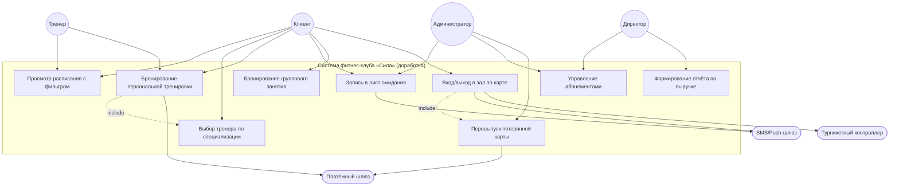
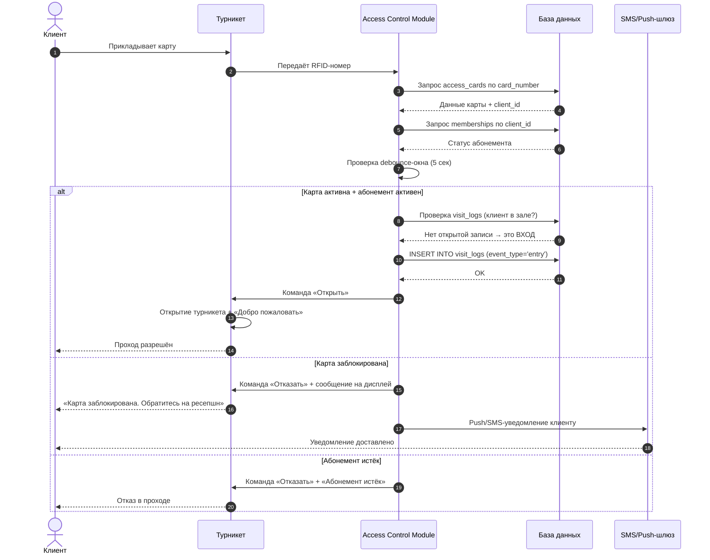
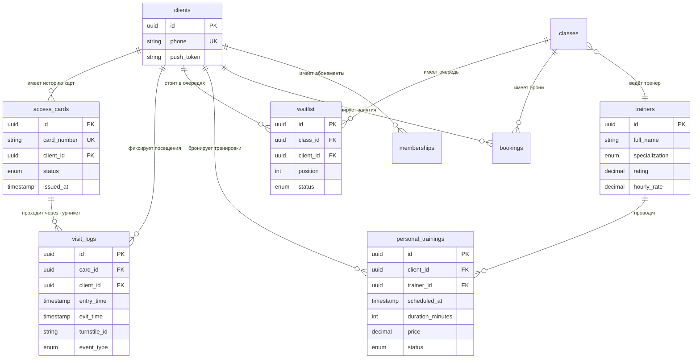

# 📦 ПАКЕТ 3: Логика, Интеграции, Сценарии, CRUD-матрица

## ✅ РАЗДЕЛ 7. ЛОГИКА СИСТЕМЫ

### 7.1. Проверка карточки на турникете (вход и выход)

**КОГДА:** Клиент прикладывает электронную карту к считывателю турникета

**ЕСЛИ:**

- Карта валидна (существует в системе и не повреждена) И
- Статус карты = `active` И
- У клиента есть активный абонемент (`memberships.status = 'active'`, `end_date >= CURRENT_DATE`, `freeze_status != 'frozen'`) И
- Прошло более 5 секунд с последней успешной операции по этой карте на этом турникете (debounce-окно закрыто)

**ТОГДА:**

- Если клиент **в зале** (последняя запись в `visit_logs` имеет `exit_time IS NULL`):
  - Система фиксирует **выход**: обновляет запись в `visit_logs` (проставляет `exit_time = CURRENT_TIMESTAMP`)
  - Отправляет команду «Открыть» на контроллер турникета
  - Возвращает событие `EXIT_SUCCESS` в журнал аудита
- Если клиент **не в зале** (нет открытой записи в `visit_logs`):
  - Система фиксирует **вход**: создаёт новую запись в `visit_logs` (`event_type = 'entry'`, `exit_time = NULL`)
  - Отправляет команду «Открыть» на контроллер турникета
  - Возвращает событие `ENTRY_SUCCESS` в журнал аудита
- Турникет издаёт звуковой сигнал «Проход разрешён», на дисплее — «Добро пожаловать» / «До свидания»

**ИНАЧЕ ЕСЛИ:** Карта существует, но статус = `blocked`:

- Турникет **не открывается**
- На дисплее выводится: «Карта заблокирована. Обратитесь на ресепшн»
- Система инициирует отправку Push/SMS-уведомления клиенту с тем же текстом (двухканальное информирование)
- В журнал аудита записывается событие `ACCESS_DENIED_BLOCKED`

**ИНАЧЕ ЕСЛИ:** Карта валидна, но абонемент истёк (`end_date < CURRENT_DATE`):

- Турникет **не открывается**
- На дисплее: «Абонемент истёк»
- В журнал аудита: `ACCESS_DENIED_EXPIRED`

**ИНАЧЕ ЕСЛИ:** Карта валидна, но абонемент заморожен (`freeze_status = 'frozen'`):

- Турникет **не открывается**
- На дисплее: «Абонемент заморожен»
- В журнал аудита: `ACCESS_DENIED_FROZEN`

**ИНАЧЕ ЕСЛИ:** Повторное прикладывание той же карты в течение 5 секунд после успешного прохода:

- Событие **игнорируется** (программный debounce-таймер на контроллере)
- Турникет не реагирует, сообщение не выводится
- В журнал аудита **не пишется** (это штатная защита, не инцидент)

**ИНАЧЕ** (карта не распознана считывателем / не существует в системе):

- Турникет **не открывается**
- На дисплее: «Карта недействительна»
- В журнал аудита: `ACCESS_DENIED_UNKNOWN_CARD`

---

### 7.2. Автоматическая запись из листа ожидания (при освобождении места)

**КОГДА:** Клиент отменяет бронь на групповое занятие ИЛИ администратор снимает клиента с занятия

**ЕСЛИ:**

- В таблице `waitlist` есть хотя бы одна запись со статусом `waiting` для данного `class_id` И
- Первая по позиции запись имеет статус `waiting` И
- У клиента, стоящего первым в очереди, есть активный абонемент

**ТОГДА:**

- Система изменяет статус записи в `waitlist` на `booked`
- Система создаёт новую запись в `bookings` для этого клиента на данное занятие
- Система уменьшает счётчик свободных мест (фактически — место уже было свободно, но теперь занято)
- Система отправляет первому в очереди Push/SMS-уведомление: «Вы записаны на занятие [название] в [время]. Подтвердите явку в приложении»
- Система сдвигает позиции всех остальных клиентов в очереди (position -= 1)
- Каждому сдвинутому клиенту отправляется Push/SMS: «Ваша позиция в очереди: [новая позиция]»
- В журнал аудита: `WAITLIST_AUTO_BOOKED`

**ИНАЧЕ** (в листе ожидания нет записей со статусом `waiting`):

- Место остаётся свободным
- Уведомления не отправляются
- В журнал аудита: `WAITLIST_EMPTY`

> **Важное уточнение:** Автоматическое списание оплаты **не производится**. Клиент получает уведомление и должен подтвердить явку в приложении (или отменить). Это защищает от штрафных санкций за неявку, если клиент уже передумал.

---

### 7.3. Бронирование персональной тренировки

**КОГДА:** Клиент выбирает тренера, дату и время для персональной тренировки и нажимает «Забронировать»

**ЕСЛИ:**

- Выбранная дата находится в пределах 7 дней от текущей даты (`scheduled_at <= CURRENT_DATE + 7 days`) И
- У выбранного тренера нет другой тренировки в этот слот (проверка уникального индекса `(trainer_id, scheduled_at)`) И
- У клиента есть активный абонемент И
- Платёжный шлюз успешно авторизовал сумму (`trainers.hourly_rate`)

**ТОГДА:**

- Система создаёт запись в `personal_trainings`:
  - `client_id` = ID клиента
  - `trainer_id` = ID выбранного тренера
  - `scheduled_at` = выбранная дата/время
  - `duration_minutes` = 60 (согласно R-17)
  - `price` = `trainers.hourly_rate`
  - `status` = `scheduled`
- Система списывает средства с карты клиента через платёжный шлюз
- Система отправляет клиенту Push/SMS: «Персональная тренировка с [ФИО тренера] забронирована на [дата/время]. Стоимость: [сумма] руб.»
- Система отправляет тренеру Push/SMS: «Новая персональная тренировка: [ФИО клиента], [дата/время]»
- В журнал аудита: `PERSONAL_TRAINING_BOOKED`

**ИНАЧЕ ЕСЛИ:** Выбранная дата далее 7 дней от текущей:

- Бронирование **не создаётся**
- Система выводит сообщение: «Бронирование персональной тренировки доступно не более чем за 7 дней вперёд»
- В журнал аудита: `BOOKING_DENIED_DATE_LIMIT`

**ИНАЧЕ ЕСЛИ:** У выбранного тренера слот уже занят:

- Бронирование **не создаётся**
- Система показывает: «Это время уже занято. Выберите другое время или другого тренера»
- Система предлагает альтернативные свободные слоты этого тренера на 7 дней
- В журнал аудита: `BOOKING_DENIED_TRAINER_BUSY`

**ИНАЧЕ ЕСЛИ:** Платёжный шлюз отклонил оплату:

- Бронирование **не создаётся**
- Система выводит: «Не удалось провести оплату. Проверьте данные карты или выберите другой способ оплаты»
- В журнал аудита: `BOOKING_DENIED_PAYMENT_FAILED`

**ИНАЧЕ** (у клиента нет активного абонемента):

- Бронирование **не создаётся**
- Система выводит: «Для бронирования персональной тренировки необходим активный абонемент»
- В журнал аудита: `BOOKING_DENIED_NO_MEMBERSHIP`

---

## ✅ РАЗДЕЛ 8. ИНТЕГРАЦИИ

### ИНТЕГРАЦИЯ 1: Турникетный контроллер

**Назначение:** Физический контроль прохода клиентов через турникеты (вход и выход), отображение сообщений на дисплее, фиксация событий прохода.

| Параметр           | Значение                                                                          | Обоснование                                                                                                                             |
| ------------------ | --------------------------------------------------------------------------------- | --------------------------------------------------------------------------------------------------------------------------------------- |
| **Тип интеграции** | Синхронная (с асинхронным журналированием)                                        | Команда открытия турникета должна выполняться в реальном времени (≤ 0.5 сек). Журнал посещений пишется асинхронно через очередь событий |
| **Протокол**       | HTTPS REST API (TLS 1.2+) или TCP/IP (проприетарный протокол контроллера)         | Зависит от модели турникетов. Современные контроллеры поддерживают REST; старые — TCP/IP                                                |
| **Формат данных**  | JSON                                                                              | Стандарт для REST API, удобен для логирования и отладки                                                                                 |
| **Направление**    | Двустороннее: Система → Контроллер (команды), Контроллер → Система (события)      | Система отправляет команды «Открыть» и «Вывести сообщение»; контроллер возвращает статус выполнения и события считывания карт           |
| **Аутентификация** | API Key + IP-whitelist                                                            | Контроллеры имеют статические IP, доступ только из внутренней сети клуба                                                                |
| **SLA**            | Время отклика ≤ 500 мс (p95). Доступность 99.9% в часы работы клуба (06:00–23:00) | Критично для клиентского опыта                                                                                                          |

**Обработка ошибок:**

- При таймауте ответа контроллера (> 2 сек) — система повторяет команду до 3 раз с экспоненциальной задержкой (100 мс, 500 мс, 1000 мс)
- При 3 неудачных попытках — турникет переходит в fallback-режим (локальное кэширование активных карт на контроллере), создаётся инцидент в системе мониторинга, администратор получает уведомление
- При потере связи с контроллером — события прохода буферизуются на стороне контроллера и синхронизируются при восстановлении связи

**Примеры JSON-сообщений:**

_Запрос: проверка карты и открытие турникета_

```json
POST /api/v1/turnstiles/{turnstile_id}/access
{
  "card_number": "RFID-1234567890",
  "timestamp": "2026-09-11T08:15:30Z",
  "event_type": "entry",
  "client_id": "uuid-client-001"
}
```

_Успешный ответ контроллера:_

```json
{
  "status": "granted",
  "turnstile_id": "TS-ENTRANCE-01",
  "action": "open",
  "display_message": "Добро пожаловать",
  "processed_at": "2026-09-11T08:15:30Z",
  "latency_ms": 127
}
```

_Ответ при заблокированной карте:_

```json
{
  "status": "denied",
  "reason": "card_blocked",
  "turnstile_id": "TS-ENTRANCE-01",
  "action": "deny",
  "display_message": "Карта заблокирована. Обратитесь на ресепшн",
  "notify_client": true,
  "notification_channels": ["push", "sms"],
  "processed_at": "2026-09-11T08:15:30Z"
}
```

_Событие от контроллера (webhook в систему):_

```json
{
  "event_type": "card_swiped",
  "turnstile_id": "TS-EXIT-02",
  "card_number": "RFID-1234567890",
  "timestamp": "2026-09-11T19:45:12Z",
  "direction": "exit",
  "result": "success"
}
```

_[📸 ЗДЕСЬ ВСТАВИТЬ СКРИНШОТ ФРАГМЕНТА OPENAPI (SWAGGER) СПЕЦИФИКАЦИИ ДЛЯ ЭНДПОИНТА `/api/v1/turnstiles/{turnstile_id}/access`]_

---

### ИНТЕГРАЦИЯ 2: Платёжный шлюз

**Назначение:** Обработка онлайн-оплат за персональные тренировки, перевыпуск карт (500 руб.), покупку абонементов. Возвраты средств при отмене бронирований.

| Параметр           | Значение                                                                             | Обоснование                                                                                 |
| ------------------ | ------------------------------------------------------------------------------------ | ------------------------------------------------------------------------------------------- |
| **Тип интеграции** | Синхронная (инициация платежа) + Асинхронная (webhook о статусе)                     | Клиент ожидает мгновенного результата при оплате; финальный статус может прийти с задержкой |
| **Протокол**       | HTTPS REST API (TLS 1.2+)                                                            | Стандарт для платёжных шлюзов                                                               |
| **Формат данных**  | JSON                                                                                 | Стандарт для REST API                                                                       |
| **Направление**    | Двустороннее: Система → Шлюз (инициация платежа), Шлюз → Система (webhook о статусе) | Система инициирует платёж; шлюз асинхронно уведомляет о результате                          |
| **Аутентификация** | API Key + HMAC-подпись запросов                                                      | Безопасность платёжных операций                                                             |
| **Соответствие**   | PCI DSS Level 1 (сертифицированный шлюз: ЮKassa / CloudPayments / Тинькофф)          | Система **не хранит** данные банковских карт — только токены                                |
| **SLA**            | Время отклика ≤ 2 сек (p95). Доступность 99.95%                                      | Критично для конверсии оплат                                                                |

**Обработка ошибок:**

- При таймауте ответа шлюза (> 5 сек) — система повторяет запрос до 2 раз
- При отказе шлюза (недостаточно средств, карта заблокирована) — клиенту выводится причина отказа, предлагается повторить с другой картой или выбрать наличные (для перевыпуска карты — только онлайн)
- При недоступности шлюза (> 30 сек) — платёж ставится в очередь на повторную попытку через 5 минут, клиенту выводится: «Платёж обрабатывается. Мы уведомим вас о результате»
- Все платёжные операции логируются в `payments` с полным audit trail

**Примеры JSON-сообщений:**

_Запрос: инициация платежа за персональную тренировку_

```json
POST /api/v1/payments
{
  "amount": 2500.00,
  "currency": "RUB",
  "description": "Персональная тренировка с Ивановым И.И., 15.09.2026 18:00",
  "client_id": "uuid-client-001",
  "payment_token": "tok_abc123xyz",
  "order_id": "PT-2026-00142",
  "order_type": "personal_training",
  "return_url": "https://silafit.ru/payments/return",
  "webhook_url": "https://api.silaf.ru/webhooks/payments"
}
```

_Успешный ответ шлюза:_

```json
{
  "payment_id": "pay_789xyz",
  "status": "pending",
  "amount": 2500.0,
  "currency": "RUB",
  "created_at": "2026-09-11T10:30:00Z",
  "confirmation_url": "https://pay.gateway.ru/confirm/789xyz"
}
```

_Webhook от шлюза (асинхронное уведомление):_

```json
{
  "event": "payment.succeeded",
  "payment_id": "pay_789xyz",
  "order_id": "PT-2026-00142",
  "amount": 2500.0,
  "status": "succeeded",
  "paid_at": "2026-09-11T10:30:45Z",
  "payment_method": "bank_card",
  "card_last4": "4242",
  "signature": "hmac_sha256_signature_here"
}
```

_Webhook при отказе:_

```json
{
  "event": "payment.failed",
  "payment_id": "pay_789xyz",
  "order_id": "PT-2026-00142",
  "amount": 2500.0,
  "status": "failed",
  "error_code": "insufficient_funds",
  "error_message": "Недостаточно средств на карте",
  "failed_at": "2026-09-11T10:30:45Z",
  "signature": "hmac_sha256_signature_here"
}
```

_[📸 ЗДЕСЬ ВСТАВИТЬ СКРИНШОТ ФРАГМЕНТА OPENAPI (SWAGGER) СПЕЦИФИКАЦИИ ДЛЯ ЭНДПОИНТА `/api/v1/payments`]_

---

### ИНТЕГРАЦИЯ 3: SMS/Push-шлюз уведомлений _(бонусная, для полноты картины)_

**Назначение:** Отправка уведомлений клиентам (лист ожидания, заблокированная карта, подтверждение брони) и тренерам.

| Параметр           | Значение                                                                                    | Обоснование                                       |
| ------------------ | ------------------------------------------------------------------------------------------- | ------------------------------------------------- |
| **Тип интеграции** | Асинхронная (через очередь сообщений Redis)                                                 | Уведомления не должны блокировать бизнес-операции |
| **Протокол**       | REST API шлюза (финальная доставка) + Redis Queue (внутренняя маршрутизация)                | Гарантированная доставка с retry                  |
| **Формат данных**  | JSON                                                                                        | Стандарт                                          |
| **SLA**            | Доставка Push: ≤ 5 сек. Доставка SMS: ≤ 60 сек                                              | Критично для уведомлений о заблокированных картах |
| **Retry-политика** | Экспоненциальная задержка: 30 сек → 1 мин → 5 мин. После 3 неудач — dead-letter queue (DLQ) | Гарантия доставки без потери сообщений            |

**Пример JSON-сообщения в очереди:**

```json
{
  "event_type": "waitlist_position_update",
  "client_id": "uuid-client-001",
  "client_phone": "+79XXXXXXXXX",
  "channels": ["push", "sms"],
  "message": "Ваша позиция в очереди на йогу (15.09, 19:00): 2-й",
  "priority": "normal",
  "retry_count": 0,
  "created_at": "2026-09-11T18:00:00Z"
}
```

---

## ✅ РАЗДЕЛ 9. СЦЕНАРИИ ИСПОЛЬЗОВАНИЯ

### СЦЕНАРИЙ 1: Вход и выход в зал по электронной карте

**Название сценария:** Вход и выход в зал по электронной карте
**Актор:** Клиент
**Связанные роли:** Администратор (разблокирует карты, решает инциденты)
**Связанные модули:** Модуль контроля доступа, Модуль управления картами

**Предусловия:**

1. У клиента есть электронная карта доступа (статус `active` или `blocked`)
2. У клиента есть абонемент (активный, истёкший или замороженный)
3. Турникет исправен и подключён к системе
4. Клиент находится перед турникетом (вход или выход)

**Триггер:** Клиент прикладывает электронную карту к считывателю турникета

---

**Основной поток (Happy Path — вход в зал):**

1. Клиент прикладывает карту к считывателю турникета на входе
2. Считыватель передаёт RFID-номер карты в систему контроля доступа
3. Система находит карту в `access_cards` по `card_number`
4. Система проверяет статус карты: `status = 'active'`
5. Система находит связанного клиента (`client_id`) и его абонемент в `memberships`
6. Система проверяет: `memberships.status = 'active'` И `end_date >= CURRENT_DATE` И `freeze_status != 'frozen'`
7. Система проверяет debounce-окно: с момента последней успешной операции по этой карте на этом турникете прошло > 5 секунд
8. Система проверяет, находится ли клиент уже в зале (ищет запись в `visit_logs` с `exit_time IS NULL`) — такой записи нет, значит клиент снаружи
9. Система создаёт новую запись в `visit_logs`: `event_type = 'entry'`, `exit_time = NULL`, `entry_time = CURRENT_TIMESTAMP`
10. Система отправляет команду «Открыть» на контроллер турникета
11. Турникет открывается, на дисплее появляется «Добро пожаловать», звуковой сигнал
12. Клиент проходит в зал

---

**Основной поток (Happy Path — выход из зала):**

1. Клиент прикладывает карту к считывателю турникета на выходе
2. Считыватель передаёт RFID-номер карты в систему
3. Система находит карту и клиента (шаги 3–5 как выше)
4. Система проверяет абонемент (шаг 6 как выше)
5. Система проверяет debounce-окно (шаг 7 как выше)
6. Система находит открытую запись клиента в `visit_logs` (где `exit_time IS NULL`) — такая запись есть, значит клиент в зале
7. Система обновляет запись: `exit_time = CURRENT_TIMESTAMP`
8. Система отправляет команду «Открыть» на контроллер турникета
9. Турникет открывается, на дисплее «До свидания», звуковой сигнал
10. Клиент покидает зал

---

**Альтернативный поток А1: Повторное прикладывание карты в течение 5 секунд (debounce)**

- К шагу 7 основного потока: клиент случайно приложил карту второй раз в течение 5 секунд после успешного прохода
- Система обнаруживает, что debounce-окно ещё не закрыто (`last_success_time + 5 sec > CURRENT_TIMESTAMP`)
- Событие **игнорируется**: турникет не реагирует, сообщение на дисплее не выводится
- В журнал аудита запись **не добавляется** (это штатная защита, не инцидент)
- Результат: клиент не создаёт ложных записей в журнале посещений

**Альтернативный поток А2: Клиент забыл карту, но администратор разблокировал ситуацию**

- К шагу 4: статус карты = `blocked`
- Система блокирует проход (основной поток прерывается)
- Клиент обращается к администратору на ресепшн
- Администратор проверяет причину блокировки в системе
- Если карта потеряна — администратор инициирует перевыпуск (оплата 500 руб. через платёжный шлюз, создание новой карты)
- Если блокировка была ошибочной — администратор меняет статус карты на `active`
- Клиент повторно прикладывает карту (новую или разблокированную) — основной поток продолжается

---

**Исключительный поток Е1: Турникет не отвечает (аппаратный сбой)**

- К шагу 10: система отправляет команду «Открыть», но контроллер турникета не отвечает в течение 2 секунд
- Система повторяет команду до 3 раз с экспоненциальной задержкой (100 мс, 500 мс, 1000 мс)
- Если после 3 попыток ответа нет:
  - Турникет остаётся закрытым
  - На дисплее: «Техническая ошибка. Обратитесь к администратору»
  - Система создаёт инцидент в журнале с приоритетом «Высокий»
  - Администратор получает Push-уведомление о сбое турникета
  - Клиент проходит через ресепшн (администратор открывает дверь вручную и отмечает проход в системе)
- Результат: цель достигнута альтернативным путём, инцидент зафиксирован

**Исключительный поток Е2: Сбой базы данных**

- К шагу 9: система не может создать запись в `visit_logs` (сбой БД)
- Турникет **не открывается** (без записи в журнале проход не разрешается — это требование безопасности)
- На дисплее: «Техническая ошибка. Обратитесь к администратору»
- Система создаёт инцидент, администратор получает уведомление
- Клиент проходит через ресепшн, администратор вручную отмечает проход после восстановления БД
- Результат: цель достигнута альтернативным путём, данные восстановлены

---

### СЦЕНАРИЙ 2: Запись в лист ожидания

**Название сценария:** Запись клиента в лист ожидания на полностью укомплектованное занятие
**Актор:** Клиент
**Связанные роли:** Администратор (обрабатывает лист ожидания вручную при сбоях)
**Связанные модули:** Модуль бронирования и расписания

**Предусловия:**

1. Клиент авторизован в системе
2. У клиента есть активный абонемент
3. В системе существует групповое занятие, на которое клиент хочет записаться
4. На занятии все места заняты (`bookings.count >= classes.max_capacity`)

**Триггер:** Клиент нажимает кнопку «Встать в лист ожидания» на странице полностью укомплектованного занятия

---

**Основной поток:**

1. Клиент открывает страницу группового занятия (например, «Йога, 15.09, 19:00»)
2. Система отображает информацию о занятии и проверяет количество свободных мест
3. Система определяет, что свободных мест нет (`bookings.count >= classes.max_capacity`)
4. Система отображает кнопку «Встать в лист ожидания» и текущее количество людей в очереди (например, «В очереди: 2 человека»)
5. Клиент нажимает кнопку «Встать в лист ожидания»
6. Система проверяет, что клиент ещё не стоит в очереди на это занятие (уникальный индекс `(class_id, client_id, status='waiting')`)
7. Система создаёт запись в `waitlist`:
   - `class_id` = ID занятия
   - `client_id` = ID клиента
   - `status` = `waiting`
   - `position` = текущее количество людей в очереди + 1
   - `added_at` = CURRENT_TIMESTAMP
8. Система отправляет клиенту Push/SMS-уведомление: «Вы в листе ожидания на [название занятия]. Ваша позиция: [N]»
9. Система отображает клиенту экран подтверждения с позицией в очереди и кнопкой «Выйти из листа ожидания»
10. Клиент видит свою позицию в очереди в реальном времени (обновление при изменении)

---

**Альтернативный поток А1: Клиент выходит из листа ожидания**

- К шагу 10: клиент передумал и нажимает «Выйти из листа ожидания»
- Система изменяет статус записи в `waitlist` на `cancelled`
- Система сдвигает позиции всех клиентов, стоявших после этого клиента (position -= 1)
- Каждому сдвинутому клиенту отправляется Push/SMS: «Ваша позиция в очереди: [новая позиция]»
- Результат: клиент удалён из очереди, цель не достигнута (но это осознанное решение клиента)

**Альтернативный поток А2: Место освободилось — автоматическая запись из очереди**

- К шагу 10 (в любой момент времени): другой клиент отменяет свою бронь на это занятие
- Система обнаруживает освобождение места
- Система находит первую запись в `waitlist` со статусом `waiting` (по позиции)
- Система изменяет статус этой записи на `booked`
- Система создаёт запись в `bookings` для этого клиента
- Система отправляет Push/SMS клиенту: «Вы записаны на [название занятия]. Подтвердите явку в приложении»
- **Важно:** Автоматическое списание оплаты **не производится** — клиент должен подтвердить явку
- Система сдвигает позиции остальных клиентов в очереди
- Результат: место заполнено из очереди, клиент уведомлён

---

**Исключительный поток Е1: Клиент уже стоит в очереди на это занятие**

- К шагу 6: система обнаруживает, что у клиента уже есть запись в `waitlist` с `status = 'waiting'` для этого `class_id`
- Система выводит сообщение: «Вы уже в листе ожидания на это занятие. Ваша текущая позиция: [N]»
- Запись не создаётся
- Результат: цель не достигнута (дублирование предотвращено)

**Исключительный поток Е2: У клиента нет активного абонемента**

- К шагу 6: система проверяет абонемент клиента и обнаруживает, что он истёк или заморожен
- Система выводит сообщение: «Для записи в лист ожидания необходим активный абонемент. Продлите абонемент в разделе "Мои абонементы"»
- Запись в `waitlist` не создаётся
- Результат: цель не достигнута

**Исключительный поток Е3: Занятие отменено администратором**

- К шагу 10 (в любой момент времени): администратор отменяет занятие
- Система находит все записи в `waitlist` со статусом `waiting` для этого занятия
- Система изменяет их статус на `expired`
- Каждому клиенту отправляется Push/SMS: «Занятие [название] на [дата/время] отменено. Вы удалены из листа ожидания»
- Результат: очередь распущена, клиенты уведомлены

---

## ✅ РАЗДЕЛ 10. CRUD-МАТРИЦА

**Легенда:**

- **C** — Create (создание сущности)
- **R** — Read (чтение)
- **U** — Update (обновление)
- **D** — Delete (удаление)

| Сценарий \ Сущность                           | access_cards (Карточка) | visit_logs (Журнал посещений) | bookings (Бронь) | waitlist (Лист ожидания) | personal_trainings (Персональная тренировка) | trainers (Тренер) |
| --------------------------------------------- | ----------------------- | ----------------------------- | ---------------- | ------------------------ | -------------------------------------------- | ----------------- |
| **Вход в зал по карточке**                    | R                       | C                             | —                | —                        | —                                            | —                 |
| **Выход из зала по карточке**                 | R                       | U                             | —                | —                        | —                                            | —                 |
| **Бронирование группового занятия**           | R                       | —                             | C                | —                        | —                                            | R                 |
| **Отмена бронирования**                       | R                       | —                             | U                | —                        | —                                            | —                 |
| **Запись в лист ожидания**                    | R                       | —                             | R                | C                        | —                                            | R                 |
| **Выход из листа ожидания**                   | R                       | —                             | —                | U                        | —                                            | —                 |
| **Автозапись из листа ожидания**              | R                       | —                             | C                | U                        | —                                            | —                 |
| **Бронирование персональной тренировки**      | R                       | —                             | —                | —                        | C                                            | R                 |
| **Отмена персональной тренировки**            | R                       | —                             | —                | —                        | U                                            | —                 |
| **Перевыпуск карты**                          | U                       | —                             | —                | —                        | —                                            | —                 |
| **Блокировка карты**                          | U                       | —                             | —                | —                        | —                                            | —                 |
| **Просмотр расписания с фильтром по тренеру** | —                       | —                             | R                | —                        | —                                            | R                 |

---

### 📊 Пояснения по заполнению CRUD-матрицы

**Вход в зал по карточке:**

- `access_cards`: **R** — система читает данные карты для проверки статуса
- `visit_logs`: **C** — система создаёт новую запись о входе (`event_type = 'entry'`)

**Выход из зала по карточке:**

- `access_cards`: **R** — система читает данные карты
- `visit_logs`: **U** — система обновляет существующую запись (проставляет `exit_time`)

**Бронирование группового занятия:**

- `access_cards`: **R** — проверка, что у клиента есть активная карта (косвенно — активный абонемент)
- `bookings`: **C** — создание новой брони
- `trainers`: **R** — чтение данных о тренере, ведущем занятие

**Отмена бронирования:**

- `bookings`: **U** — изменение статуса брони на `cancelled`

**Запись в лист ожидания:**

- `waitlist`: **C** — создание новой записи в очереди
- `bookings`: **R** — проверка, что мест действительно нет
- `trainers`: **R** — чтение данных о тренере занятия

**Автозапись из листа ожидания:**

- `bookings`: **C** — создание брони для клиента из очереди
- `waitlist`: **U** — изменение статуса записи с `waiting` на `booked`

**Бронирование персональной тренировки:**

- `personal_trainings`: **C** — создание новой записи о персональной тренировке
- `trainers`: **R** — проверка доступности тренера и чтение его `hourly_rate`

**Перевыпуск/блокировка карты:**

- `access_cards`: **U** — изменение статуса карты (`blocked`, `active`), обновление `blocked_at`, `reissue_count`

---

## 🎨 ПРИЛОЖЕНИЯ (Mermaid-диаграммы)

### Приложение A. Use Case Diagram



---

### Приложение B. Sequence Diagram — Вход в зал по карте



---

### Приложение C. ERD (модель данных — уже из Пакета 1, здесь для полноты)


