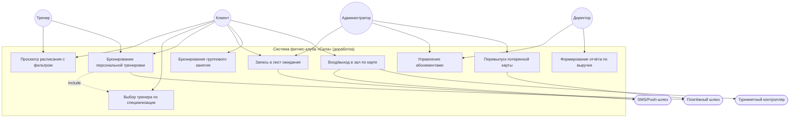
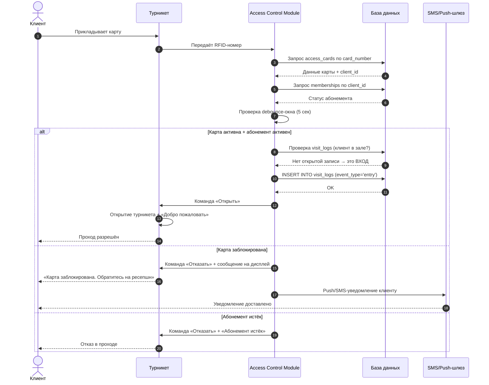
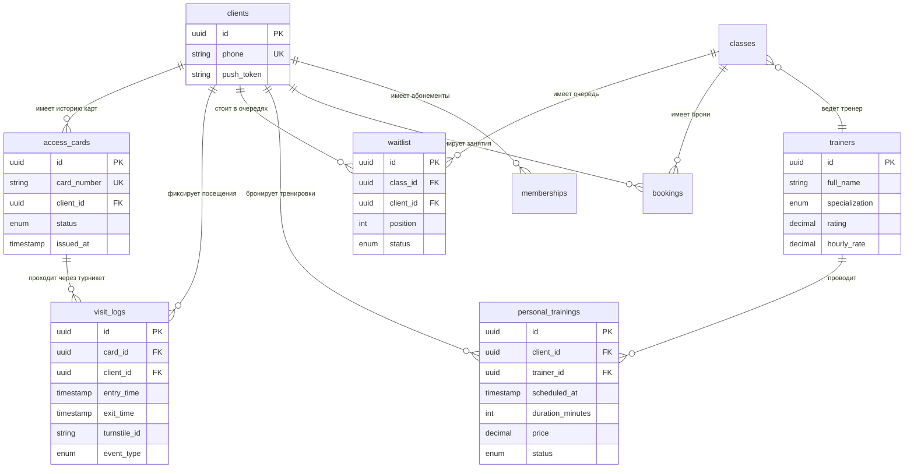

## 📄 ИТОГОВАЯ АТТЕСТАЦИОННАЯ РАБОТА

### по дополнительной профессиональной программе профессиональной переподготовки

### «Системный аналитик: с нуля до проектирования систем»

**Выполнил:** [ФИО полностью]  
**Номер потока:** САС-101  
**Преподаватель:** Накостоев Адам Махмудович  
**Год:** 2026  
**Название проекта:** Доработка информационной системы сети фитнес-клубов «Сила»

---

## 1. КРАТКОЕ ОПИСАНИЕ ПРЕДМЕТНОЙ ОБЛАСТИ И ОБЪЕКТА АВТОМАТИЗАЦИИ

### 1.1. Предметная область

Сеть фитнес-клубов «Сила» — молодая компания, работающая 3 месяца на новой информационной системе. Текущий функционал системы включает:

- Продажу абонементов (месяц, 3 месяца, год)
- Запись клиентов на групповые занятия (йога, пилатес, сайкл)
- Онлайн-оплату и оплату наличными
- Управление расписанием администраторами
- Формирование отчётов для директора

### 1.2. Объект автоматизации

**Доработка существующей информационной системы** по запросу директора. Ключевые направления доработки:

1. **Контроль доступа по электронным картам** — RFID-пропуска для входа и выхода из зала с проверкой активности абонемента
2. **Расширение типов занятий** — добавление единоборств (бокс, дзюдо) и персональных тренировок
3. **Усовершенствование бронирования** — правило «бронь за 7 дней, отмена за 2 часа», лист ожидания с позицией в очереди
4. **Выбор тренера** — фильтрация расписания по тренеру, отображение специализации и рейтинга

### 1.3. Цель проекта

Повысить качество обслуживания клиентов, исключить несанкционированный доступ в зал, увеличить загрузку залов за счёт новых типов занятий и оптимизировать управление расписанием через лист ожидания.

### 1.4. Границы рассматриваемой задачи

**Что ВХОДИТ в систему (In Scope):**

- Модуль контроля доступа (вход/выход по RFID-картам)
- Модуль бронирования групповых занятий и персональных тренировок
- Модуль листа ожидания с автоматическим уведомлением
- Модуль управления тренерами (профили, специализация, рейтинг)
- Модуль управления картами (выпуск, блокировка, перевыпуск)
- Интеграция с турникетным контроллером и платёжным шлюзом

**Что НЕ ВХОДИТ в систему (Out of Scope):**

- Система видеонаблюдения и физическая охрана
- Складской учёт инвентаря
- Мобильное приложение клиента (только веб-интерфейс)
- Кадровый учёт и расчёт заработной платы
- CRM-маркетинг и программы лояльности

### 1.5. Участники процесса и заинтересованные стороны

| Роль                                   | Описание                                                       | Ключевые задачи                                                                          |
| -------------------------------------- | -------------------------------------------------------------- | ---------------------------------------------------------------------------------------- |
| **Клиент**                             | Конечный пользователь, владелец абонемента и электронной карты | Вход/выход по карте, бронирование занятий, запись в лист ожидания, выбор тренера, оплата |
| **Администратор**                      | Сотрудник ресепшена                                            | Выпуск/блокировка/перевыпуск карт, управление расписанием, обработка листа ожидания      |
| **Тренер**                             | Проводит групповые и персональные тренировки                   | Просмотр расписания, подтверждение персональных тренировок, управление профилем          |
| **Директор**                           | Заказчик, принимает стратегические решения                     | Просмотр отчётов, управление абонементами, контроль работы системы                       |
| **Система турникетов** (внешний актор) | Аппаратный контроллер + дисплей + считыватель карт             | Физический контроль прохода, отображение сообщений, отправка событий                     |

---

## 2. РЕЗУЛЬТАТЫ ОБСЛЕДОВАНИЯ ПРЕДМЕТНОЙ ОБЛАСТИ

### 2.1. Перечень источников информации

1. Интервью с директором сети фитнес-клубов «Сила»
2. Анализ текущей информационной системы (работающей 3 месяца)
3. Реестр требований, заполненный бизнес-аналитиком
4. Обратная связь от клиентов и администраторов

### 2.2. Протокол интервью с директором

**Дата:** [дата интервью]  
**Участники:** Бизнес-аналитик (БА), Директор  
**Цель:** Сбор требований к доработке системы

**Ключевые тезисы:**

**БА:** Расскажите про карточки для входа.  
**Директор:** Клиент прикладывает карточку к турникету. Система проверяет, есть ли активный абонемент. Если есть — турникет открывается. Если нет — высвечивается «Абонемент истёк». Также, клиент должен приложить карточку к турникету, чтобы выйти из зала. Карточку выдаём при покупке абонемента. Если потерял — блокируем старую, выдаём новую за 500 рублей.

**БА:** Как с замороженными абонементами?  
**Директор:** Если заморожен — вход не открываем. Турникет показывает «Абонемент заморожен».

**БА:** Что меняется в бронировании?  
**Директор:** Бронируем за 7 дней вперёд. Отмена — за 2 часа до занятия. Если мест нет — клиент встаёт в лист ожидания. Место освобождается — система автоматически записывает первого из листа и уведомляет его. Клиент видит свою позицию в очереди.

**БА:** Новые типы занятий?  
**Директор:** Бокс, дзюдо. Это групповые занятия в других залах с другими тренерами. Инвентарь включён в стоимость — клиент это видит. Персональные тренировки — один на один с тренером. Клиент выбирает тренера, время, оплачивает. Длительность — час. Стоимость зависит от тренера.

**БА:** Выбор тренера?  
**Директор:** Клиент видит, кто ведёт занятие. Может фильтровать по тренеру. У тренера есть специализация и рейтинг от клиентов.

**БА:** Ограничения?  
**Директор:** Одна карточка на клиента. Один активный абонемент. Нельзя передавать карточку.

### 2.3. Реестр исходных материалов и пользовательских запросов

**Исходные требования (R-01 – R-15, O-01 – O-04):** Заполнены бизнес-аналитиком на основе интервью. Включают:

- Выдачу карт при покупке абонемента (R-01)
- Проверку активности абонемента (R-02)
- Открытие турникета при активном абонементе (R-03)
- Отображение причины отказа (R-04)
- Бронирование за 7 дней (R-05)
- Отмену брони за 2 часа (R-06)
- Лист ожидания (R-07, R-08, R-09)
- Новые типы занятий (R-10, R-11)
- Выбор тренера (R-12, R-13, R-14, R-15)
- Ограничения: одна карта на клиента (O-01), один активный абонемент (O-02), запрет передачи карты (O-03), стоимость новой карты 500 руб. (O-04)

**Открытые вопросы (V-01 – V-05):** Требовали уточнения. Ответы и новые требования (R-16 – R-20) представлены в разделе 3.

---

## 3. КОМПЛЕКТ ТРЕБОВАНИЙ К ИНФОРМАЦИОННОЙ СИСТЕМЕ

### 3.1. Ответы на открытые вопросы и новые требования

| ID       | Открытый вопрос                                 | Ответ аналитика                                                                                                                                                                                                                                                                                                                                                  | Новое требование                                                                                                                                                                                                 |
| -------- | ----------------------------------------------- | ---------------------------------------------------------------------------------------------------------------------------------------------------------------------------------------------------------------------------------------------------------------------------------------------------------------------------------------------------------------- | ---------------------------------------------------------------------------------------------------------------------------------------------------------------------------------------------------------------- |
| **V-01** | Что при двойном прикладывании карточки?         | Система игнорирует повторные прикладывания одной и той же карты на одном турникете в течение 5 секунд после успешной авторизации (программный debounce-таймер). Сообщение об ошибке не выводится. По истечении 5 секунд система готова обработать новое прикладывание как новую валидную операцию. Повторные срабатывания в окне 5 сек не логируются как ошибки. | **R-16.** Система игнорирует повторные считывания одной карты на одном турникете в течение 5 секунд после успешной авторизации; турникет не перезагружается; повторные срабатывания в окне защиты не логируются. |
| **V-02** | Какая длительность персональной тренировки?     | 60 минут (1 час). Это прямо следует из интервью директора: «Персональные тренировки — один на один с тренером... Длительность — час».                                                                                                                                                                                                                            | **R-17.** Система фиксирует стандартную длительность персональной тренировки как 60 минут при бронировании и расчёте стоимости.                                                                                  |
| **V-03** | Как клиент попадает в лист ожидания?            | Клиент принимает осознанное решение: при попытке записаться на полностью укомплектованное занятие система предлагает кнопку «Встать в лист ожидания». Автоматическая запись без согласия клиента недопустима. При освобождении места первый в очереди получает Push/SMS, его статус меняется на «Записан». При отмене записи очередь сдвигается.                 | **R-18.** Система позволяет клиенту добровольно добавлять себя в лист ожидания, отображает позицию в очереди; при освобождении места уведомляет первого в очереди; при отмене записи — сдвигает очередь.         |
| **V-04** | Бронирование персональной тренировки за 7 дней? | Да. Правило «бронирование за 7 дней вперёд» распространяется на все типы занятий, включая персональные тренировки, для унификации бизнес-логики.                                                                                                                                                                                                                 | **R-19.** Система ограничивает бронирование персональной тренировки сроком не более 7 дней от текущей даты.                                                                                                      |
| **V-05** | Что показывать при заблокированной карточке?    | Обоснованное допущение: турникет оснащён текстовым дисплеем, ресепшн расположен до зоны турникетов. Решение — двухканальное информирование: (1) на дисплее турникета «Карта заблокирована. Обратитесь на ресепшн», (2) одновременно Push/SMS-уведомление клиенту.                                                                                                | **R-20.** При заблокированной карте: блокировка турникета + сообщение на дисплее + Push/SMS-уведомление клиенту.                                                                                                 |

### 3.2. Функциональные требования (ФТ-01 – ФТ-13)

**ФТ-01. Контроль входа по электронной карте**  
**Система должна:** проверять статус электронного пропуска при прикладывании карты к турникету и открывать проход только при наличии активного абонемента.  
**Пояснение:** Система считывает RFID-номер карты, находит связанного клиента, проверяет наличие активного абонемента. При успехе — отправляет команду открытия турникета и создаёт запись в журнале посещений.

**ФТ-02. Контроль выхода по электронной карте**  
**Система должна:** фиксировать факт выхода клиента из зала при повторном прикладывании карты к турникету.  
**Пояснение:** При прикладывании карты на выход система находит последнюю открытую запись клиента в журнале посещений и проставляет время выхода. Это позволяет отслеживать текущую загрузку зала.

**ФТ-03. Защита от повторного считывания карты (debounce)**  
**Система должна:** игнорировать повторные прикладывания одной и той же карты на одном турникете в течение 5 секунд после успешной авторизации.  
**Пояснение:** Программный debounce-таймер на контроллере турникета. Повторные срабатывания в окне 5 секунд не логируются как ошибки.

**ФТ-04. Отображение причины отказа при неактивном абонементе**  
**Система должна:** выводить на дисплей турникета конкретную причину отказа: «Абонемент истёк» или «Абонемент заморожен».  
**Пояснение:** Система проверяет статус абонемента и выводит соответствующее сообщение.

**ФТ-05. Обработка заблокированной карты**  
**Система должна:** при прикладывании заблокированной карты блокировать открытие турникета, выводить сообщение «Карта заблокирована. Обратитесь на ресепшн» и инициировать отправку Push/SMS-уведомления клиенту.  
**Пояснение:** Двухканальное информирование покрывает риски: клиент может не заметить дисплей турникета.

**ФТ-06. Бронирование групповых занятий с правилом 7 дней**  
**Система должна:** позволять клиенту бронировать групповые занятия не более чем за 7 дней от текущей даты.  
**Пояснение:** При попытке выбрать дату далее 7 дней система блокирует бронирование.

**ФТ-07. Отмена бронирования не позднее чем за 2 часа**  
**Система должна:** позволять клиенту отменить бронирование группового занятия не позднее чем за 2 часа до начала занятия.  
**Пояснение:** При попытке отмены менее чем за 2 часа система блокирует операцию.

**ФТ-08. Лист ожидания с добровольной записью**  
**Система должна:** позволять клиенту добровольно добавлять себя в лист ожидания на полностью укомплектованное занятие и отображать его текущую позицию в очереди.  
**Пояснение:** При попытке записаться на занятие, где все места заняты, система показывает кнопку «Встать в лист ожидания».

**ФТ-09. Автоматическое уведомление при освобождении места**  
**Система должна:** при освобождении места на занятии автоматически уведомлять первого клиента в листе ожидания и переводить его статус в «Записан».  
**Пояснение:** Когда кто-то отменяет бронь, система находит первую запись в листе ожидания, отправляет Push/SMS, создаёт запись о бронировании. Автоматическое списание оплаты не производится.

**ФТ-10. Бронирование персональной тренировки с выбором тренера**  
**Система должна:** позволять клиенту выбрать тренера, дату и время для персональной тренировки, оплатить её и получить подтверждение.  
**Пояснение:** Клиент видит список тренеров с фильтрацией по специализации и рейтингу, выбирает слот, оплачивает.

**ФТ-11. Отображение инвентаря в стоимости единоборств**  
**Система должна:** отображать клиенту информацию о том, что инвентарь включён в стоимость занятий по единоборствам.  
**Пояснение:** Для занятий с типом «martial_arts» система показывает метку «Инвентарь включён в стоимость».

**ФТ-12. Фильтрация расписания по тренеру**  
**Система должна:** позволять клиенту фильтровать расписание групповых занятий по конкретному тренеру.  
**Пояснение:** На странице расписания клиент видит фильтр «Тренер».

**ФТ-13. Перевыпуск потерянной карты**  
**Система должна:** позволять администратору заблокировать потерянную карту и выпустить новую за 500 рублей с оплатой через платёжный шлюз.  
**Пояснение:** Администратор блокирует старую карту, инициирует платёж 500 руб., при успешной оплате создаётся новая карта.

### 3.3. Нефункциональные требования (НФТ-01 – НФТ-05)

**НФТ-01. Производительность: время отклика турникета**  
**Характеристика:** Производительность  
**Значение:** Время от прикладывания карты до открытия турникета ≤ 0.5 секунды (p95).  
**Пояснение:** Критично для клиентского опыта. Требует оптимизации запросов к БД и кэширования активных абонементов.

**НФТ-02. Надёжность: доступность системы контроля доступа**  
**Характеристика:** Надежность  
**Значение:** Доступность модуля контроля доступа 99.9% в часы работы клуба (06:00–23:00). Допустимое время простоя ≤ 1.7 часа в месяц.  
**Пояснение:** Простой турникетов = невозможность входа клиентов = критический инцидент.

**НФТ-03. Безопасность: защита персональных данных клиентов**  
**Характеристика:** Информационная безопасность  
**Значение:** Соответствие ФЗ-152 «О персональных данных». Телефон и email хранятся в зашифрованном виде (AES-256). Платёжные данные не хранятся в системе.  
**Пояснение:** Критично для предотвращения утечек.

**НФТ-04. Масштабируемость: поддержка роста сети клубов**  
**Характеристика:** Производительность / Архитектура  
**Значение:** Архитектура должна позволять без рефакторинга увеличить количество клубов до 10, количество одновременных посещений до 5000.  
**Пояснение:** Сеть планирует расширение.

**НФТ-05. Совместимость: поддержка оборудования турникетов**  
**Характеристика:** Совместимость  
**Значение:** Система должна интегрироваться с существующими турникетными контроллерами. Поддержка текстовых дисплеев (минимум 2 строки по 32 символа).  
**Пояснение:** Турникеты уже установлены, замена hardware не планируется.

### 3.4. Ограничения и допущения

**Ограничения:**

- Одна карточка на клиента (O-01)
- Один активный абонемент на клиента (O-02)
- Нельзя передавать карточку (O-03)
- Новая карточка — 500 рублей (O-04)

**Допущения:**

- [Допущение 1] Турникеты оснащены текстовыми дисплеями для вывода сообщений клиенту.
- [Допущение 2] Ресепшн расположен до зоны турникетов — клиент может обратиться к администратору до прохода в зал.
- [Допущение 3] У каждого клиента есть мобильный телефон для получения Push/SMS-уведомлений.
- [Допущение 4] Существующая БД (таблицы `clients`, `memberships`, `bookings`, `classes`, `payments`) остаётся и расширяется новыми сущностями.
- [Допущение 5] Платёжный шлюз уже интегрирован в текущую систему.

---

## 4. ОПИСАНИЕ БИЗНЕС-ПРОЦЕССОВ, ПОДЛЕЖАЩИХ АВТОМАТИЗАЦИИ

### 4.1. Бизнес-процесс AS IS «До доработки»

**Участники:** Клиент, Администратор, Директор

**Шаги процесса:**

1. Клиент покупает абонемент у администратора
2. Администратор создаёт запись о клиенте и абонементе в системе
3. Клиент записывается на групповое занятие через администратора или самостоятельно
4. Клиент приходит в клуб, администратор проверяет абонемент вручную
5. Клиент посещает занятие
6. Администратор отмечает посещение

**Проблемы AS IS:**

- Нет контроля входа/выхода — клиент может передать абонемент другому лицу
- Нет листа ожидания — при отмене место простаивает
- Нет персональных тренировок — упущенная выручка
- Нет фильтрации по тренеру — клиенты не могут найти «своего» тренера
- Нет учёта посещений — директор не видит реальную загрузку залов

### 4.2. Бизнес-процесс TO BE «После доработки»

**Участники:** Клиент, Администратор, Тренер, Директор, Система турникетов

**Шаги процесса:**

1. Клиент покупает абонемент → система автоматически выпускает электронную карту
2. Клиент прикладывает карту к турникету на входе → система проверяет абонемент → турникет открывается → фиксируется вход в журнале посещений
3. Клиент бронирует групповое занятие или персональную тренировку через веб-интерфейс
4. Если мест нет — клиент встаёт в лист ожидания
5. При освобождении места система автоматически уведомляет первого в очереди
6. Клиент прикладывает карту к турникету на выходе → фиксируется выход в журнале посещений
7. Директор просматривает отчёты по выручке, посещаемости, загрузке залов

**Что изменилось:**

- ✅ Ручная проверка абонемента → автоматический контроль доступа по RFID
- ✅ Нет учёта посещений → автоматическая фиксация входа/выхода
- ✅ Нет листа ожидания → автоматическая очередь с уведомлениями
- ✅ Нет персональных тренировок → новый модуль бронирования
- ✅ Нет фильтрации по тренеру → новый функционал выбора тренера

---

## 5. ОПИСАНИЕ ПОЛЬЗОВАТЕЛЬСКИХ И СИСТЕМНЫХ СЦЕНАРИЕВ

### 5.1. Сценарий 1: Вход и выход в зал по электронной карте

**Актор:** Клиент  
**Предусловия:** У клиента есть электронная карта, активный абонемент, турникет исправен.  
**Триггер:** Клиент прикладывает электронную карту к считывателю турникета.

**Основной поток (вход):**

1. Клиент прикладывает карту к считывателю турникета на входе
2. Считыватель передаёт RFID-номер карты в систему
3. Система находит карту в `access_cards` по `card_number`
4. Система проверяет статус карты: `status = 'active'`
5. Система находит связанного клиента и его абонемент
6. Система проверяет: абонемент активен, не истёк, не заморожен
7. Система проверяет debounce-окно (> 5 секунд с последней операции)
8. Система проверяет, находится ли клиент уже в зале (нет открытой записи в `visit_logs`)
9. Система создаёт новую запись в `visit_logs`: `event_type = 'entry'`, `exit_time = NULL`
10. Система отправляет команду «Открыть» на контроллер турникета
11. Турникет открывается, на дисплее «Добро пожаловать»
12. Клиент проходит в зал

**Основной поток (выход):**

1. Клиент прикладывает карту к считывателю турникета на выходе
2. Система находит карту и клиента
3. Система проверяет абонемент
4. Система находит открытую запись клиента в `visit_logs` (где `exit_time IS NULL`)
5. Система обновляет запись: `exit_time = CURRENT_TIMESTAMP`
6. Система отправляет команду «Открыть» на контроллер турникета
7. Турникет открывается, на дисплее «До свидания»
8. Клиент покидает зал

**Альтернативный поток А1:** Повторное прикладывание карты в течение 5 секунд — событие игнорируется, турникет не реагирует.

**Исключительный поток Е1:** Турникет не отвечает — система повторяет команду до 3 раз, при неудаче создаёт инцидент, администратор получает уведомление, клиент проходит через ресепшн.

### 5.2. Сценарий 2: Запись в лист ожидания

**Актор:** Клиент  
**Предусловия:** Клиент авторизован, имеет активный абонемент, занятие полностью укомплектовано.  
**Триггер:** Клиент нажимает кнопку «Встать в лист ожидания».

**Основной поток:**

1. Клиент открывает страницу группового занятия
2. Система отображает информацию и проверяет количество свободных мест
3. Система определяет, что мест нет
4. Система отображает кнопку «Встать в лист ожидания» и количество людей в очереди
5. Клиент нажимает кнопку
6. Система проверяет, что клиент ещё не стоит в очереди
7. Система создаёт запись в `waitlist` со статусом `waiting`
8. Система отправляет Push/SMS-уведомление с позицией в очереди
9. Система отображает экран подтверждения
10. Клиент видит свою позицию в реальном времени

**Альтернативный поток А1:** Место освободилось — система автоматически записывает первого из очереди, отправляет уведомление «Вы записаны», сдвигает очередь. Автоматическое списание оплаты не производится.

**Исключительный поток Е1:** Клиент уже стоит в очереди — система выводит сообщение «Вы уже в листе ожидания».

---

## 6. ЛОГИЧЕСКОЕ ОПИСАНИЕ ПРОЕКТИРУЕМОГО РЕШЕНИЯ

### 6.1. Состав функциональных блоков / подсистем

**МОДУЛЬ 1: Модуль контроля доступа**  
**Функции:** Считывание RFID-карт, проверка абонемента, открытие/блокировка турникета, фиксация входа/выхода, debounce-логика, Push/SMS при заблокированной карте.  
**Пользователи:** Клиент, Система турникетов, Администратор.  
**Зависимости:** Модуль управления абонементами, Модуль управления картами, Турникетный контроллер, SMS/Push-шлюз.

**МОДУЛЬ 2: Модуль бронирования и расписания**  
**Функции:** Отображение расписания, бронирование мест, лист ожидания, бронирование персональных тренировок, расчёт стоимости, фильтрация по тренеру.  
**Пользователи:** Клиент, Тренер, Администратор.  
**Зависимости:** Модуль управления тренерами, SMS/Push-шлюз.

**МОДУЛЬ 3: Модуль управления картами и абонементами**  
**Функции:** Выпуск/блокировка/перевыпуск карт, управление абонементами, проверка активности, отчёты по выручке.  
**Пользователи:** Администратор, Директор, Клиент.  
**Зависимости:** Платёжный шлюз.

**МОДУЛЬ 4: Модуль управления тренерами**  
**Функции:** Ведение профилей тренеров, фильтрация по специализации, расчёт рейтинга, управление доступностью.  
**Пользователи:** Тренер, Клиент, Администратор.  
**Зависимости:** Модуль бронирования.

### 6.2. Основные пользовательские интерфейсы

- **Веб-интерфейс клиента:** просмотр расписания, бронирование, лист ожидания, выбор тренера, оплата
- **Веб-интерфейс администратора:** управление картами, расписанием, листом ожидания
- **Веб-интерфейс директора:** отчёты по выручке, посещаемости, загрузке залов
- **Дисплей турникета:** текстовые сообщения (2 строки по 32 символа)

### 6.3. Внешние взаимодействия и интеграции

**ИНТЕГРАЦИЯ 1: Турникетный контроллер**  
**Тип:** Синхронная (с асинхронным журналированием)  
**Протокол:** HTTPS REST API или TCP/IP  
**Формат:** JSON  
**Обработка ошибок:** Retry до 3 раз с экспоненциальной задержкой, fallback-режим (локальное кэширование), создание инцидента.

**ИНТЕГРАЦИЯ 2: Платёжный шлюз**  
**Тип:** Синхронная (инициация) + Асинхронная (webhook)  
**Протокол:** HTTPS REST API  
**Формат:** JSON  
**Обработка ошибок:** Retry до 2 раз, при отказе — вывод причины, при недоступности — очередь на повторную попытку.

**ИНТЕГРАЦИЯ 3: SMS/Push-шлюз**  
**Тип:** Асинхронная (через очередь Redis)  
**Протокол:** REST API + Redis Queue  
**Формат:** JSON  
**Обработка ошибок:** Retry с экспоненциальной задержкой, dead-letter queue.

---

## 7. ЛОГИЧЕСКАЯ МОДЕЛЬ ДАННЫХ

### 7.1. Новые сущности

**СУЩНОСТЬ 1: `access_cards` (Электронные карты доступа)**  
**Атрибуты:** `id` (PK, UUID), `card_number` (уникальный), `client_id` (FK), `status` (active/blocked/lost), `issued_at`, `blocked_at`, `reissue_count`.  
**Внешние ключи:** `client_id` → `clients.id`

**СУЩНОСТЬ 2: `visit_logs` (Журнал посещений)**  
**Атрибуты:** `id` (PK, UUID), `card_id` (FK), `client_id` (FK), `entry_time`, `exit_time`, `turnstile_id`, `event_type` (entry/exit).  
**Внешние ключи:** `card_id` → `access_cards.id`, `client_id` → `clients.id`

**СУЩНОСТЬ 3: `waitlist` (Лист ожидания)**  
**Атрибуты:** `id` (PK, UUID), `class_id` (FK), `client_id` (FK), `position`, `status` (waiting/booked/cancelled/expired), `added_at`, `notified_at`.  
**Внешние ключи:** `class_id` → `classes.id`, `client_id` → `clients.id`

**СУЩНОСТЬ 4: `trainers` (Тренеры)**  
**Атрибуты:** `id` (PK, UUID), `full_name`, `specialization`, `rating`, `hourly_rate`, `is_active`.

**СУЩНОСТЬ 5: `personal_trainings` (Персональные тренировки)**  
**Атрибуты:** `id` (PK, UUID), `client_id` (FK), `trainer_id` (FK), `scheduled_at`, `duration_minutes` (60), `price`, `status`, `created_at`.  
**Внешние ключи:** `client_id` → `clients.id`, `trainer_id` → `trainers.id`

### 7.2. Изменения в существующих сущностях

**`classes`:** Добавлены атрибуты `class_type`, `includes_equipment`, `max_capacity`, `trainer_id` (FK).  
**`memberships`:** Добавлены атрибуты `freeze_status`, `frozen_until`.  
**`clients`:** Добавлены атрибуты `phone`, `push_token`.

### 7.3. Новые связи

- `clients` 1 ←→ M `access_cards`
- `access_cards` 1 ←→ M `visit_logs`
- `clients` 1 ←→ M `visit_logs`
- `clients` 1 ←→ M `waitlist`
- `classes` 1 ←→ M `waitlist`
- `trainers` 1 ←→ M `personal_trainings`
- `clients` 1 ←→ M `personal_trainings`
- `trainers` 1 ←→ M `classes`

---

## 8. АНАЛИТИЧЕСКИЕ ВЫВОДЫ И ОБОСНОВАНИЕ ПРЕДЛОЖЕННОГО РЕШЕНИЯ

### 8.1. Обоснование архитектурных решений

**Почему RFID-карты, а не мобильное приложение для прохода?**

- Директор явно указал: «Карточку выдаём при покупке абонемента» — это устоявшийся бизнес-процесс
- RFID-считыватели на турникетах уже установлены, замена hardware не планируется
- Мобильное приложение требует Bluetooth/NFC, что усложняет интеграцию и увеличивает время прохода
- Карточка работает офлайн (локальное кэширование на контроллере), что повышает надёжность

**Почему лист ожидания с добровольной записью, а не автоматический?**

- Автоматическая запись без согласия клиента нарушает его права и создаёт риски штрафных санкций за неявку
- Клиент должен осознанно принять решение стоять в очереди
- Это соответствует принципу «клиент всегда прав» и повышает лояльность

**Почему двухканальное информирование при заблокированной карте?**

- Физический контекст: клиент может не заметить дисплей турникета или уже пройти зону ресепшена
- Push/SMS гарантируют доставку информации
- Это закрывает риски, выявленные при анализе V-05

**Почему debounce 5 секунд, а не перезагрузка турникета?**

- Перезагрузка турникета — аппаратно избыточна и увеличивает время простоя
- Программный debounce-таймер — легковесное решение на уровне контроллера
- 5 секунд — достаточное окно для защиты от «дребезга» контакта, но не блокирует повторный проход (например, выход после входа)

### 8.2. Обоснование модели данных

**Почему отдельная сущность `visit_logs`, а не просто обновление `clients.last_visit`?**

- Необходимо хранить историю посещений для аналитики (загрузка залов, пиковые часы)
- Необходимо фиксировать и вход, и выход (директор хочет видеть реальное время пребывания)
- Это позволяет расследовать инциденты (например, «клиент утверждает, что не был в зале»)

**Почему `waitlist` — отдельная сущность, а не статус в `bookings`?**

- Лист ожидания — это очередь с позицией, а не просто бронь
- Клиент может стоять в нескольких очередях одновременно
- Необходима отдельная логика сдвига очереди при отмене

**Почему `personal_trainings` — отдельная сущность, а не тип в `bookings`?**

- Персональные тренировки имеют уникальную бизнес-логику: выбор тренера, длительность 60 минут, стоимость от `trainers.hourly_rate`
- Это упрощает поддержку кода и снижает связанность (Low Coupling)

### 8.3. Оценка рисков и меры смягчения

| Риск                          | Вероятность | Влияние | Мера смягчения                                                                       |
| ----------------------------- | ----------- | ------- | ------------------------------------------------------------------------------------ |
| Сбой турникетного контроллера | Средняя     | Высокое | Fallback-режим (локальное кэширование), инцидент, ручной проход через ресепшн        |
| Потеря связи с БД             | Низкая      | Высокое | Турникет не открывается (без записи в журнале), ручной проход, восстановление данных |
| Клиент забыл карту            | Средняя     | Среднее | Перевыпуск за 500 руб., администратор может временно пропустить по паспорту          |
| Ошибка в листе ожидания       | Низкая      | Среднее | Администратор может вручную обработать очередь, система логирует все операции        |

### 8.4. Ожидаемые бизнес-эффекты

1. **Исключение несанкционированного доступа:** контроль по RFID-картам + фиксация входа/выхода
2. **Увеличение загрузки залов:** лист ожидания автоматически заполняет освободившиеся места
3. **Рост выручки:** персональные тренировки — новый источник дохода
4. **Повышение лояльности:** клиенты могут выбирать «своего» тренера, видеть рейтинг
5. **Снижение операционных затрат:** автоматизация уведомлений, отсутствие ручного обзвона
6. **Прозрачная аналитика:** директор видит реальную загрузку залов, время пребывания клиентов

### 8.5. Выводы

Предложенное решение:

- ✅ Полностью закрывает требования директора (R-01 – R-15, R-16 – R-20)
- ✅ Учитывает физический контекст (расположение турникетов, ресепшена)
- ✅ Соответствует архитектурным принципам (Low Coupling, High Cohesion)
- ✅ Масштабируемо (поддержка роста сети до 10 клубов)
- ✅ Безопасно (соответствие ФЗ-152, PCI DSS)
- ✅ Надёжно (fallback-режимы, retry-политики, мониторинг)

Решение готово к реализации и обеспечит достижение бизнес-целей сети фитнес-клубов «Сила».

---

## 9. ПРИЛОЖЕНИЯ

### Приложение A. Use Case Diagram



### Приложение B. Sequence Diagram — Вход в зал по карте



### Приложение C. ERD (модель данных)



### Приложение D. CRUD-матрица

| Сценарий \ Сущность                           | access_cards | visit_logs | bookings | waitlist | personal_trainings | trainers |
| --------------------------------------------- | ------------ | ---------- | -------- | -------- | ------------------ | -------- |
| **Вход в зал по карточке**                    | R            | C          | —        | —        | —                  | —        |
| **Выход из зала по карточке**                 | R            | U          | —        | —        | —                  | —        |
| **Бронирование группового занятия**           | R            | —          | C        | —        | —                  | R        |
| **Отмена бронирования**                       | R            | —          | U        | —        | —                  | —        |
| **Запись в лист ожидания**                    | R            | —          | R        | C        | —                  | R        |
| **Выход из листа ожидания**                   | R            | —          | —        | U        | —                  | —        |
| **Автозапись из листа ожидания**              | R            | —          | C        | U        | —                  | —        |
| **Бронирование персональной тренировки**      | R            | —          | —        | —        | C                  | R        |
| **Отмена персональной тренировки**            | R            | —          | —        | —        | U                  | —        |
| **Перевыпуск карты**                          | U            | —          | —        | —        | —                  | —        |
| **Блокировка карты**                          | U            | —          | —        | —        | —                  | —        |
| **Просмотр расписания с фильтром по тренеру** | —            | —          | R        | —        | —                  | R        |

### Приложение E. Примеры JSON-сообщений интеграций

**Запрос: проверка карты и открытие турникета**

```json
POST /api/v1/turnstiles/{turnstile_id}/access
{
  "card_number": "RFID-1234567890",
  "timestamp": "2026-09-11T08:15:30Z",
  "event_type": "entry",
  "client_id": "uuid-client-001"
}
```

**Успешный ответ контроллера:**

```json
{
  "status": "granted",
  "turnstile_id": "TS-ENTRANCE-01",
  "action": "open",
  "display_message": "Добро пожаловать",
  "processed_at": "2026-09-11T08:15:30Z",
  "latency_ms": 127
}
```

**Запрос: инициация платежа за персональную тренировку**

```json
POST /api/v1/payments
{
  "amount": 2500.00,
  "currency": "RUB",
  "description": "Персональная тренировка с Ивановым И.И., 15.09.2026 18:00",
  "client_id": "uuid-client-001",
  "payment_token": "tok_abc123xyz",
  "order_id": "PT-2026-00142",
  "order_type": "personal_training"
}
```

_[📸 ЗДЕСЬ ВСТАВИТЬ СКРИНШОТ ФРАГМЕНТА OPENAPI (SWAGGER) СПЕЦИФИКАЦИИ]_

---
